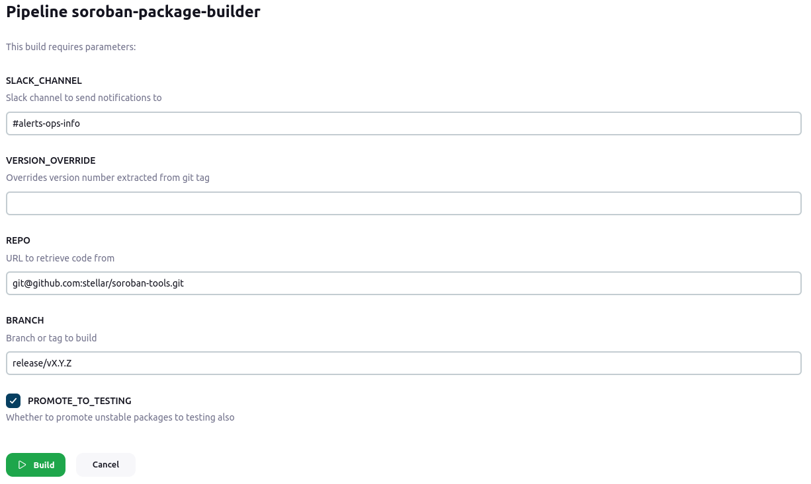
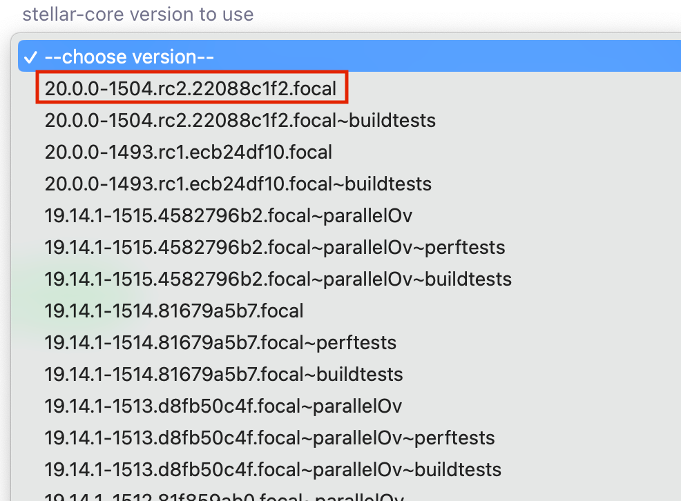
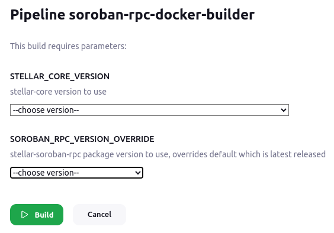
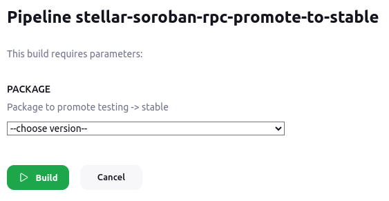

# Releasing

To release Soroban RPC, follow this process **in order**:

## Update Horizon Version Dependency
1. Run `go get github.com/hcnet/go@<horizon_release_tag>` to update `go.mod` and `go.sum` to match the tagged Horizon version branch.
2. Commit this change to `main` in a pull request

## Follow Rust Workflow
Currently, the `soroban-rpc` repo doesn't publish crates, so we will be running a *modified* version of our main [Rust release workflow](https://github.com/hcnet/actions/blob/main/README-rust-release.md).

1. Run the [Bump Version workflow](https://github.com/hcnet/actions/blob/main/README-rust-release.md#step-1-run-the-bump-version-workflow) from `main`
2. [Review the PR](https://github.com/hcnet/actions/blob/main/README-rust-release.md#2-review-pr) from running the Bump Version workflow
3. [Merge the PR](https://github.com/hcnet/actions/blob/main/README-rust-release.md#3-merge-pr) after the publish dry runs complete successfully. Although currently we don't publish crates from the `soroban-rpc` repo, we want the dry runs to succeed.

## Create a GitHub Release From a Tag
1. Create an annotated tag with `git tag -a v<release_version_number> -m "Description for release"`
2. Push the tag to remote with `git push origin --tags`
3. Create a new [GitHub release](https://github.com/hcnet/soroban-rpc/releases/new) from the previously created tag.
    * The release title MUST NOT start with a v, otherwise artifact uploads fail (see [workflow file](https://github.com/hcnet/soroban-tools/blob/main/.github/workflows/publish.yml) and this [Slack thread](https://hcnetfoundation.slack.com/archives/C04ECVCV162/p1694729751569919) for context)
4. Monitor GitHub actions until they succeed

## Push New RPC Debian Package

1. Run the [Buildmeister soroban-package-builder pipeline](https://buildmeister-v3.hcnet-ops.com/job/Platform/job/soroban-package-builder/)
    * Set `VERSION_OVERRIDE` if necessary, replacing "-" with "~" (e.g. 20.0.0~rc1)
    * Set `BRANCH` to the release tag (e.g. v20.0.0-rc1)
    * Enable `PROMOTE_TO_TESTING`
    * 

2. Review the package stage log, and note the build number for next steps

## Push New Docker Image

For reference, here is the [Soroban RPC docker repo](https://hub.docker.com/r/hcnet/soroban-rpc)

1. Run the [Buildmeister soroban-rpc-docker-builder pipeline](https://buildmeister-v3.hcnet-ops.com/job/Platform/job/soroban-rpc-docker-builder/)
    * Double check `HCNET_CORE_VERSION` uses a version *without* test in the name
    * 
    * 

## Update Test Configs

1. Update the [monorepo’s horizon.yml integration test config](https://github.com/hcnet/go/blob/master/.github/workflows/horizon.yml) to point to the new rpc image (e.g. [go#5054](https://github.com/hcnet/go/pull/5054))

## Update Quickstart Image Configs

1. Update the quickstart image build configs to use the latest RPC and horizon (e.g. [quickstart#502](https://github.com/hcnet/quickstart/pull/502/files)).
    * Update `soroban_rpc_ref`, `go_ref`, and `core_ref` in all [build workflows](https://github.com/hcnet/quickstart/tree/master/.github/workflows)
    * Update `SOROBAN_RPC_REF`, `CORE_REF`, and `HORIZON_REF` in [the Makefile](https://github.com/hcnet/quickstart/blob/master/Makefile)

## Promote to Stable

1. Run the Buildmeister [soroban-rpc-promote-to-stable pipeline](https://buildmeister-v3.hcnet-ops.com/job/Platform/job/hcnet-soroban-rpc-promote-to-stable/)
    * Set `PACKAGE` to the release version
    * 